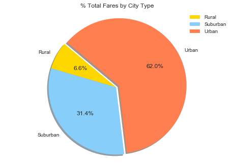

```python
#Homework # 4 - Andrew Pacumio
#Pyber data
```


```python
#import dependencies
import csv
import os
import pandas as pd
import numpy as py
import matplotlib.pyplot as plt
import plotly.plotly as py
import plotly.graph_objs as go
from collections import Counter
import matplotlib.patches as mpatches
import seaborn
```


```python
# Establish the root path and resource path
root_path = os.getcwd()
resource_path = os.path.join(root_path, "raw_data")

ride_data_file = os.path.join(resource_path, "ride_data.csv")
city_data_file = os.path.join(resource_path, "city_data.csv")
```


```python
#read the ride_data.csv file and create a data frame
ride_data_pd = pd.read_csv("raw_data/ride_data.csv")
ride_data_pd.head()
```


<div>
<style>
    .dataframe thead tr:only-child th {
        text-align: right;
    }

    .dataframe thead th {
        text-align: left;
    }

    .dataframe tbody tr th {
        vertical-align: top;
    }
</style>
<table border="1" class="dataframe">
  <thead>
    <tr style="text-align: right;">
      <th></th>
      <th>city</th>
      <th>date</th>
      <th>fare</th>
      <th>ride_id</th>
    </tr>
  </thead>
  <tbody>
    <tr>
      <th>0</th>
      <td>Sarabury</td>
      <td>2016-01-16 13:49:27</td>
      <td>38.35</td>
      <td>5403689035038</td>
    </tr>
    <tr>
      <th>1</th>
      <td>South Roy</td>
      <td>2016-01-02 18:42:34</td>
      <td>17.49</td>
      <td>4036272335942</td>
    </tr>
    <tr>
      <th>2</th>
      <td>Wiseborough</td>
      <td>2016-01-21 17:35:29</td>
      <td>44.18</td>
      <td>3645042422587</td>
    </tr>
    <tr>
      <th>3</th>
      <td>Spencertown</td>
      <td>2016-07-31 14:53:22</td>
      <td>6.87</td>
      <td>2242596575892</td>
    </tr>
    <tr>
      <th>4</th>
      <td>Nguyenbury</td>
      <td>2016-07-09 04:42:44</td>
      <td>6.28</td>
      <td>1543057793673</td>
    </tr>
  </tbody>
</table>
</div>


```python
city_data_pd = pd.read_csv("raw_data\city_data.csv")
city_data_pd.head()
```


<div>
<style>
    .dataframe thead tr:only-child th {
        text-align: right;
    }

    .dataframe thead th {
        text-align: left;
    }

    .dataframe tbody tr th {
        vertical-align: top;
    }
</style>
<table border="1" class="dataframe">
  <thead>
    <tr style="text-align: right;">
      <th></th>
      <th>city</th>
      <th>driver_count</th>
      <th>type</th>
    </tr>
  </thead>
  <tbody>
    <tr>
      <th>0</th>
      <td>Kelseyland</td>
      <td>63</td>
      <td>Urban</td>
    </tr>
    <tr>
      <th>1</th>
      <td>Nguyenbury</td>
      <td>8</td>
      <td>Urban</td>
    </tr>
    <tr>
      <th>2</th>
      <td>East Douglas</td>
      <td>12</td>
      <td>Urban</td>
    </tr>
    <tr>
      <th>3</th>
      <td>West Dawnfurt</td>
      <td>34</td>
      <td>Urban</td>
    </tr>
    <tr>
      <th>4</th>
      <td>Rodriguezburgh</td>
      <td>52</td>
      <td>Urban</td>
    </tr>
  </tbody>
</table>
</div>


```python
#stats for the bubble plot
#average fare per city
avg_fare_per_city = pd.DataFrame(ride_data_pd.groupby("city")["fare"].mean()).reset_index()
avg_fare_per_city.head()
```


<div>
<style>
    .dataframe thead tr:only-child th {
        text-align: right;
    }

    .dataframe thead th {
        text-align: left;
    }

    .dataframe tbody tr th {
        vertical-align: top;
    }
</style>
<table border="1" class="dataframe">
  <thead>
    <tr style="text-align: right;">
      <th></th>
      <th>city</th>
      <th>fare</th>
    </tr>
  </thead>
  <tbody>
    <tr>
      <th>0</th>
      <td>Alvarezhaven</td>
      <td>23.928710</td>
    </tr>
    <tr>
      <th>1</th>
      <td>Alyssaberg</td>
      <td>20.609615</td>
    </tr>
    <tr>
      <th>2</th>
      <td>Anitamouth</td>
      <td>37.315556</td>
    </tr>
    <tr>
      <th>3</th>
      <td>Antoniomouth</td>
      <td>23.625000</td>
    </tr>
    <tr>
      <th>4</th>
      <td>Aprilchester</td>
      <td>21.981579</td>
    </tr>
  </tbody>
</table>
</div>


```python
#number of rides per city
num_rides_per_city = pd.DataFrame(ride_data_pd.groupby("city")["ride_id"].count()).reset_index()
num_rides_per_city.head()
```


<div>
<style>
    .dataframe thead tr:only-child th {
        text-align: right;
    }

    .dataframe thead th {
        text-align: left;
    }

    .dataframe tbody tr th {
        vertical-align: top;
    }
</style>
<table border="1" class="dataframe">
  <thead>
    <tr style="text-align: right;">
      <th></th>
      <th>city</th>
      <th>ride_id</th>
    </tr>
  </thead>
  <tbody>
    <tr>
      <th>0</th>
      <td>Alvarezhaven</td>
      <td>31</td>
    </tr>
    <tr>
      <th>1</th>
      <td>Alyssaberg</td>
      <td>26</td>
    </tr>
    <tr>
      <th>2</th>
      <td>Anitamouth</td>
      <td>9</td>
    </tr>
    <tr>
      <th>3</th>
      <td>Antoniomouth</td>
      <td>22</td>
    </tr>
    <tr>
      <th>4</th>
      <td>Aprilchester</td>
      <td>19</td>
    </tr>
  </tbody>
</table>
</div>


```python
#number of drivers per city
num_drivers_per_city = pd.DataFrame(city_data_pd.groupby("city")["driver_count"].mean()).reset_index()
num_drivers_per_city.head()
```


<div>
<style>
    .dataframe thead tr:only-child th {
        text-align: right;
    }

    .dataframe thead th {
        text-align: left;
    }

    .dataframe tbody tr th {
        vertical-align: top;
    }
</style>
<table border="1" class="dataframe">
  <thead>
    <tr style="text-align: right;">
      <th></th>
      <th>city</th>
      <th>driver_count</th>
    </tr>
  </thead>
  <tbody>
    <tr>
      <th>0</th>
      <td>Alvarezhaven</td>
      <td>21</td>
    </tr>
    <tr>
      <th>1</th>
      <td>Alyssaberg</td>
      <td>67</td>
    </tr>
    <tr>
      <th>2</th>
      <td>Anitamouth</td>
      <td>16</td>
    </tr>
    <tr>
      <th>3</th>
      <td>Antoniomouth</td>
      <td>21</td>
    </tr>
    <tr>
      <th>4</th>
      <td>Aprilchester</td>
      <td>49</td>
    </tr>
  </tbody>
</table>
</div>


```python
#combine the dataframes together
m1 = avg_fare_per_city.merge(num_rides_per_city, left_on="city", right_on="city", how="outer")
m2 = m1.merge(num_drivers_per_city, left_on="city", right_on="city", how="outer")
main = m2.merge(city_data_pd, left_on="city", right_on="city", how="left")

#urban = gold, suburbran = light sky blue, rural = light coral
#get a color list
colors = []
for index, row in main.iterrows():
    if row["type"] == "Urban":
        #main.set_value(index, row["color"], "gold")
        colors.append("gold")
    if row["type"] == "Suburban":
        #main.set_value(index, row["color"], "lightskyblue")
        colors.append("lightskyblue")
    if row["type"] == "Rural":
        #main.set_value(index, row["color"], "coral") 
        colors.append("coral")

main.head()
```


<div>
<style>
    .dataframe thead tr:only-child th {
        text-align: right;
    }

    .dataframe thead th {
        text-align: left;
    }

    .dataframe tbody tr th {
        vertical-align: top;
    }
</style>
<table border="1" class="dataframe">
  <thead>
    <tr style="text-align: right;">
      <th></th>
      <th>city</th>
      <th>fare</th>
      <th>ride_id</th>
      <th>driver_count_x</th>
      <th>driver_count_y</th>
      <th>type</th>
    </tr>
  </thead>
  <tbody>
    <tr>
      <th>0</th>
      <td>Alvarezhaven</td>
      <td>23.928710</td>
      <td>31</td>
      <td>21</td>
      <td>21</td>
      <td>Urban</td>
    </tr>
    <tr>
      <th>1</th>
      <td>Alyssaberg</td>
      <td>20.609615</td>
      <td>26</td>
      <td>67</td>
      <td>67</td>
      <td>Urban</td>
    </tr>
    <tr>
      <th>2</th>
      <td>Anitamouth</td>
      <td>37.315556</td>
      <td>9</td>
      <td>16</td>
      <td>16</td>
      <td>Suburban</td>
    </tr>
    <tr>
      <th>3</th>
      <td>Antoniomouth</td>
      <td>23.625000</td>
      <td>22</td>
      <td>21</td>
      <td>21</td>
      <td>Urban</td>
    </tr>
    <tr>
      <th>4</th>
      <td>Aprilchester</td>
      <td>21.981579</td>
      <td>19</td>
      <td>49</td>
      <td>49</td>
      <td>Urban</td>
    </tr>
  </tbody>
</table>
</div>


```python
#define the values for the x and y axis and the size of the markers
x = main["ride_id"]
y = main["fare"]
s = [5 * x for x in main["driver_count_x"]] #multiply the driver count to make 
                                            #the scatter points more visible

#label the axis and create a title for the scatter plot
plt.title("Pyber Ride Sharing Data")
plt.xlabel("Total Number of Rides Per City")
plt.ylabel("Average Fares Per City ($)")

#define values for the legend
urban = mpatches.Patch(color='gold', label='Urban')
suburban = mpatches.Patch(color='lightskyblue', label='Suburban')
rural = mpatches.Patch(color='coral', label='Rural')

plt.scatter(x=x,y=y,s=s, color=colors, marker="o")
plt.legend(title="City Types", handles=[urban, suburban, rural], )

plt.text(37, 35, "Note: \nCircle size correlates with driver count per city", fontsize=14)

plt.show()
```


```python
#city types 
city_type = pd.DataFrame(city_data_pd.groupby("type")["city"].count()).reset_index() 
city_type
```


<div>
<style>
    .dataframe thead tr:only-child th {
        text-align: right;
    }

    .dataframe thead th {
        text-align: left;
    }

    .dataframe tbody tr th {
        vertical-align: top;
    }
</style>
<table border="1" class="dataframe">
  <thead>
    <tr style="text-align: right;">
      <th></th>
      <th>type</th>
      <th>city</th>
    </tr>
  </thead>
  <tbody>
    <tr>
      <th>0</th>
      <td>Rural</td>
      <td>18</td>
    </tr>
    <tr>
      <th>1</th>
      <td>Suburban</td>
      <td>42</td>
    </tr>
    <tr>
      <th>2</th>
      <td>Urban</td>
      <td>66</td>
    </tr>
  </tbody>
</table>
</div>


```python
#join the two dataframes together
merged_data_df = ride_data_pd.merge(city_data_pd, left_on="city", right_on="city", how="left")
```


```python
#total fares by city type
fares_by_city_type = pd.DataFrame(merged_data_df.groupby("type")["fare"].sum()).reset_index()
labels = fares_by_city_type["type"]
values = fares_by_city_type["fare"]
colors = ["gold", "lightskyblue", "coral"]
explode = [0, 0, 0.05]
plt.pie(values, labels=labels, explode=explode, colors=colors, autopct='%1.1f%%', shadow=True, startangle=140)
plt.axis('equal')
plt.title("% Total Fares by City Type")
plt.legend(labels, loc="upper right")
plt.show()
```





```python
#total rides by city type
rides_by_city_type = pd.DataFrame(merged_data_df.groupby("type")["fare"].count()).reset_index()
labels = rides_by_city_type["type"]
values = rides_by_city_type["fare"]
colors = ["gold", "lightskyblue", "coral"]
explode = [0, 0, 0.05]
plt.pie(values, labels=labels, explode=explode, colors=colors, autopct='%1.1f%%', shadow=True, startangle=140)
plt.axis('equal')
plt.title("% Total Rides by City Type")
plt.legend(labels, loc="upper right")
plt.show()
```


```python
#total drivers per city type
drivers_per_city_type = pd.DataFrame(merged_data_df.groupby("type")["driver_count"].sum()).reset_index()
labels = drivers_per_city_type["type"]
values = drivers_per_city_type["driver_count"]
colors = ["gold", "lightskyblue", "coral"]
explode = [0, 0, 0.05]
plt.pie(values, labels=labels, explode=explode, colors=colors, autopct='%1.1f%%', shadow=True, startangle=145)
plt.axis('equal')
plt.title("% Total Drivers by City Type")
plt.legend(labels, loc="upper right")
plt.show()
```


